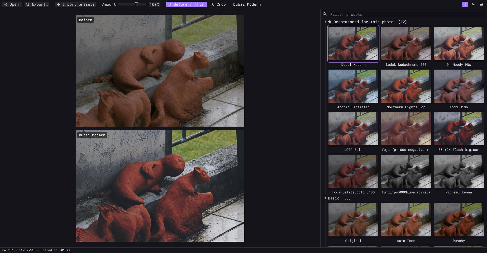

# bp_photos

A small desktop app for trying presets on photos. Open a photo, see every preset applied to it,
pick one, export. It's the preset browser from Lightroom and nothing else.

Rust + egui + wgpu. Everything runs on the GPU, so the preview and all thumbnails update instantly.
Works on macOS and Linux.



## Features

- Opens JPEG, PNG, TIFF, WebP, HEIC/AVIF and camera RAW (CR2/CR3, NEF, ARW, RAF, DNG, …).
  HEIC and RAW show their embedded preview first, then the full image.
- Reads Lightroom presets (`.xmp`, `.lrtemplate`) and `.cube` LUTs. Drop them on the window or use
  *Import presets*; they're kept in `~/Library/Application Support/bp_photos/presets`
  (`~/.config/bp_photos/presets` on Linux), one group per folder.
- Suggests about a dozen presets per photo. Every preset is rendered small and scored for clipping,
  exposure, contrast, saturation and skin tones; hover a suggestion to see why it was picked.
- Amount slider (0–150%), or scroll over the photo.
- Before/after view, or hold the mouse on the photo to see the original.
- Crop with aspect ratios (free, original, 1:1, 4:5, 2:3, 16:9).
- Export at full size or for Instagram, X, Facebook or a custom size, as JPEG, PNG or TIFF.
  Or copy to the clipboard.
- Picks up your Ghostty font and colour theme, if you use Ghostty.

Lightroom's processing isn't public, so presets come out close to Lightroom, not identical. Masks,
profiles, sharpening, noise reduction and lens corrections are ignored.

## Build

```sh
brew install libheif pkgconf        # macOS
sudo apt install libheif-dev pkg-config libxkbcommon-dev libwayland-dev libvulkan1   # Debian/Ubuntu

cargo run --release -- photo.jpg
```

`rust-toolchain.toml` pins the Rust version; rustup installs it on first build.

## Keys

| | |
|---|---|
| arrows | move through presets |
| scroll | change amount |
| `\` (hold) | show original |
| `Y` | before / after |
| `C` | crop (`X` rotates the ratio, `Enter` applies, `Esc` cancels) |
| `⌘E` / `Ctrl+E` | export |
| `⌘C` / `Ctrl+C` | copy to clipboard |

## Command line

```sh
bp_photos apply --preset "Portra-ish" --size instagram-portrait *.heic --out insta/
bp_photos recommend photo.jpg        # suggested presets and why
bp_photos presets                    # list installed presets
bp_photos bench photo.heic           # time each loading step
```

## Presets

A couple of dozen are built in. For more, these work well and are MIT licensed:

- [peva3/Lightroom-Presets](https://github.com/peva3/Lightroom-Presets): ~450 film looks (`.xmp`)
- [YahiaAngelo/Film-Luts](https://github.com/YahiaAngelo/Film-Luts): ~300 film LUTs (`.cube`)

The screenshot uses a public-domain sample from [raw.pixls.us](https://raw.pixls.us).
