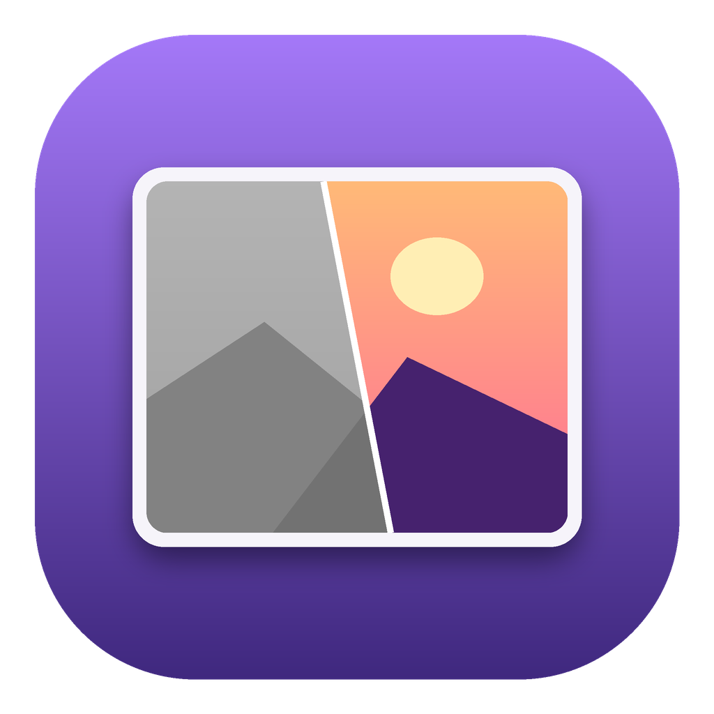
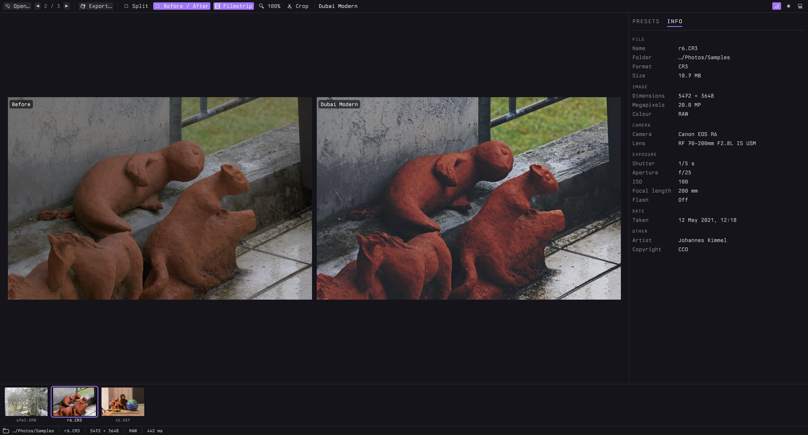
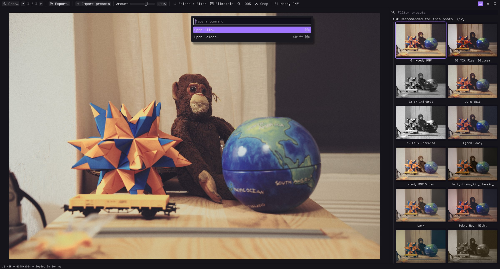

<p align="center">
  
</p>

<h1 align="center">bp_photos</h1>

A small desktop app for trying presets on photos. Open a photo, see every preset applied to it,
pick one, export. It's the preset browser from Lightroom and nothing else.

Rust + egui + wgpu. Everything runs on the GPU, so the preview and all thumbnails update instantly.
Works on macOS and Linux.




## Features

- Opens JPEG, PNG, TIFF, WebP, HEIC/AVIF and camera RAW (CR2/CR3, NEF, ARW, RAF, DNG, …).
  HEIC and RAW show their embedded preview first, then the full image.
  It's in Finder's *Open With* menu for photos on macOS, and the file manager's on Linux once
  `scripts/install-linux.sh` has run — in neither case taking over as the default app.
- Reads Lightroom presets (`.xmp`, `.lrtemplate`) and `.cube` LUTs. Drop them on the window, or use
  *Import Presets* in the command palette or the Presets menu; they're kept in `~/Library/Application Support/bp_photos/presets`
  (`~/.config/bp_photos/presets` on Linux), one group per folder.
- Suggests about a dozen presets per photo. Every preset is rendered small and scored for clipping,
  exposure, contrast, saturation and skin tones; hover a suggestion to see why it was picked.
- Amount slider (0–150%) under the presets, or scroll over the photo.
- Split view with a draggable divider, a side-by-side before/after, or hold the mouse on the photo to see the original. Zoom to 100% to check
  grain and sharpness.
- Step through the photos in a folder; the next and previous ones are decoded in the background.
  An optional filmstrip shows the whole folder, using the thumbnails already embedded in the files.
- Crop with aspect ratios (free, original, 1:1, 4:5, 2:3, 16:9).
- Export at full size or for Instagram, X, Facebook or a custom size, as JPEG, PNG or TIFF.
  Or copy to the clipboard. JPEG and PNG exports keep the date, camera, lens and exposure info,
  and the location unless you untick it.
- Picks up your Ghostty font and colour theme, if you use Ghostty.

Lightroom's processing isn't public, so presets come out close to Lightroom, not identical. Masks,
profiles, sharpening, noise reduction and lens corrections are ignored.

## Private by design

Everything happens on your computer. Photos are never uploaded, there's no account, no analytics
and no telemetry. The app only goes online if you run *Get Free Presets*, which downloads the two
preset collections listed below from GitHub.

## Download

macOS 12 or later, Apple silicon: grab the `.dmg` from
[Releases](https://github.com/changs/bp_photos/releases) and drag the app to Applications.

The app isn't notarised by Apple, so the first time macOS will refuse to open it. Open it once
from System Settings → Privacy & Security → *Open Anyway*, or run
`xattr -dr com.apple.quarantine "/Applications/BP Photos.app"`.

On Linux there's no prebuilt package: install the build dependencies below and run
`scripts/install-linux.sh`. Wayland and X11 both work.

## Build

```sh
brew install libheif pkgconf        # macOS
sudo apt install libheif-dev pkg-config libxkbcommon-dev libwayland-dev libvulkan1   # Debian/Ubuntu
sudo pacman -S libheif pkgconf libxkbcommon wayland vulkan-icd-loader                # Arch
sudo dnf install libheif-devel pkgconf-pkg-config libxkbcommon-devel wayland-devel vulkan-loader  # Fedora

cargo run --release -- photo.jpg
```

`rust-toolchain.toml` pins the Rust version; rustup installs it on first build.

You also need a working Vulkan driver (`mesa` covers Intel and AMD; `nvidia-utils` or equivalent
for NVIDIA). wgpu falls back to OpenGL if there's no Vulkan, but the previews are slower.

`scripts/bundle-macos.sh` makes `dist/BP Photos.app` and a `.dmg` (needs `brew install cmake meson ninja`).
It builds libheif with only its decoders, so no GPL encoder code ends up in the app.

`scripts/install-linux.sh` builds the app and installs it into `~/.local` with its icon and
`bp_photos.desktop`, so it shows up in the launcher and in the file manager's *Open With* menu for
photos — like the macOS bundle, without becoming the default handler. Pass `--prefix /usr/local`
(as root) for a system-wide install.

## Keys



| | |
|---|---|
| `Shift+⌘P` or `⌘K` | command palette |
| `⌘O` / `Shift+⌘O` | open a photo / a folder (opens its first photo, with the filmstrip) |
| arrows | move through presets |
| `⌘1`–`⌘9` | apply the 1st–9th recommended preset |
| `/` | search presets |
| `I` | Info tab: file, camera, lens, exposure, date and location of the photo |
| `[` / `]` | previous / next photo in the folder (preloaded, so it's instant) |
| `F` | filmstrip |
| `Z` or double-click | 100% view, drag to pan (both sides in before/after) |
| pinch, or `⌘`/`Ctrl` + scroll | zoom from fit to 800% around the pointer |
| scroll | change amount |
| `\` (hold) | show original |
| `S` | split view: original and edit either side of a divider (drag it) |
| `Y` | before / after side by side |
| `C` | crop (`X` rotates the ratio, `Enter` applies, `Esc` cancels) |
| `⌘E` / `Ctrl+E` | export |
| `⌘S` / `Ctrl+S` | quick export: full size, next to the original as `name-edited.ext`, same format (HEIC/RAW → JPEG) |
| `⌘C` / `Ctrl+C` | copy to clipboard |

## Command line

```sh
bp_photos apply --preset "Portra-ish" --size instagram-portrait *.heic --out insta/
bp_photos apply --preset "Portra-ish" --edited *.jpg   # save each as name-edited.jpg next to it
bp_photos recommend photo.jpg        # suggested presets and why
bp_photos presets                    # list installed presets
bp_photos bench photo.heic           # time each loading step
```

## Presets

A couple of dozen are built in. Run *Get Free Presets* from the command palette (`Shift+⌘P`) to
download these two MIT-licensed collections (about 30 MB, 750 looks), pinned to reviewed versions:

- [peva3/Lightroom-Presets](https://github.com/peva3/Lightroom-Presets): ~450 film looks (`.xmp`)
- [YahiaAngelo/Film-Luts](https://github.com/YahiaAngelo/Film-Luts): ~300 film LUTs (`.cube`)

The screenshots use public-domain samples from [raw.pixls.us](https://raw.pixls.us).

## Licence

MIT, see [LICENSE](LICENSE). The macOS app bundles libheif, libde265 (both LGPL-3.0) and dav1d
(BSD-2-Clause); their licences are in `BP Photos.app/Contents/Resources/Licenses`.
